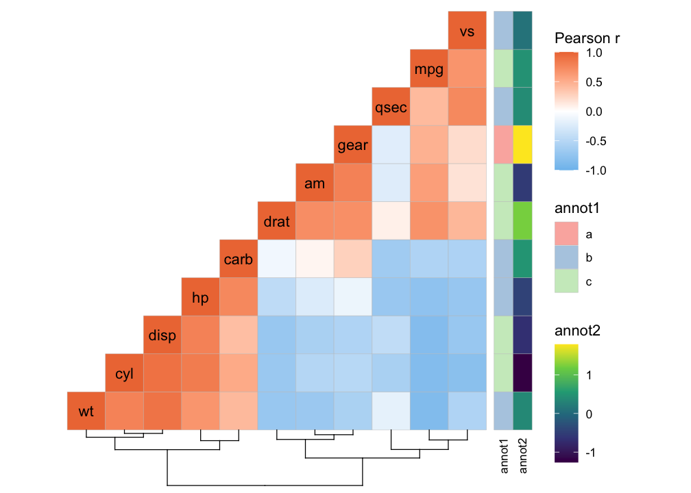
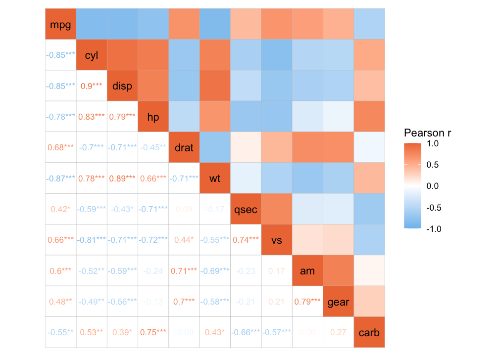

<!-- README.md is generated from README.Rmd. Please edit that file -->

# ggcorrheatmap

<!-- badges: start -->

[](https://github.com/leod123/ggcorrheatmap/actions/workflows/R-CMD-check.yaml)
<!-- badges: end -->

ggcorrheatmap is a convenient package for generating correlation
heatmaps made with ggplot2, with support for triangular layouts,
clustering and annotation. As the output is a ggplot2 object you can
further customise the appearance using familiar ggplot2 functions.
ggcorrheatmap can also build general heatmaps.

## Installation

You can install the development version of ggcorrheatmap from
[GitHub](https://github.com/) with:

``` r
# install.packages("devtools")
devtools::install_github("leod123/ggcorrheatmap")
```

## Example

Below is an example of how to generate a correlation heatmap with
clustered rows and columns and row annotation, using a triangular layout
that excludes redundant cells.

``` r
library(ggcorrheatmap)

set.seed(123)
# Make a correlation heatmap with a triangular layout, annotations and clustering
row_annot <- data.frame(.names = colnames(mtcars),
                        annot1 = sample(letters[1:3], ncol(mtcars), TRUE),
                        annot2 = rnorm(ncol(mtcars)))
ggcorrhm(mtcars, layout = "br", cluster_rows = TRUE, cluster_cols = TRUE,
         dend_rows = FALSE, annot_rows_df = row_annot)
```



It is also possible to make a normal heatmap, for a more flexible
output.

``` r
library(ggplot2)
gghm(scale(mtcars), cluster_rows = TRUE, cluster_cols = TRUE) +
  theme(axis.text.x.top = element_text(angle = 90, vjust = 0.3, hjust = 0))
```

<!-- -->
