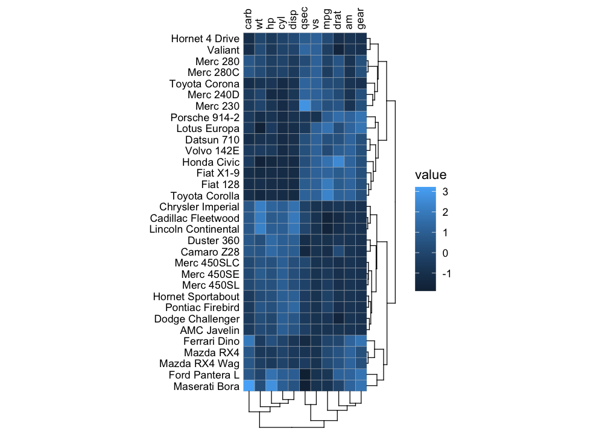

<!-- README.md is generated from README.Rmd. Please edit that file -->

# ggcorrheatmap

<!-- badges: start -->

[](https://CRAN.R-project.org/package=ggcorrheatmap)
[](https://github.com/leod123/ggcorrheatmap/actions/workflows/R-CMD-check.yaml)
[](https://app.codecov.io/gh/leod123/ggcorrheatmap/branch/main)
<!-- badges: end -->

ggcorrheatmap is a convenient package for generating correlation
heatmaps made with ggplot2, with support for triangular layouts,
clustering and annotation. As the output is a ggplot2 object you can
further customise the appearance using familiar ggplot2 functions.
Besides correlation heatmaps, there is also support for making general
heatmaps.

## Installation

You can install ggcorrheatmap from CRAN using:

``` r
install.packages("ggcorrheatmap")
```

Or you can install the development version from
[GitHub](https://github.com/) with:

``` r
# install.packages("devtools")
devtools::install_github("leod123/ggcorrheatmap")
```

## Example

Below is an example of how to generate a correlation heatmap with
clustered rows and columns and row annotation, using a triangular layout
that excludes redundant cells.

``` r
library(ggcorrheatmap)

set.seed(123)
# Make a correlation heatmap with a triangular layout, annotations and clustering
row_annot <- data.frame(.names = colnames(mtcars),
                        annot1 = sample(letters[1:3], ncol(mtcars), TRUE),
                        annot2 = rnorm(ncol(mtcars)))
ggcorrhm(mtcars, layout = "bottomright",
         cluster_rows = TRUE, cluster_cols = TRUE,
         show_dend_rows = FALSE, annot_rows_df = row_annot)
```


Or a mixed layout that displays different things in the different
triangles.

``` r
# With correlation values and p-values
ggcorrhm(mtcars, layout = c("topright", "bottomleft"),
         cell_labels = c(FALSE, TRUE), p_values = c(FALSE, TRUE))
```


It is also possible to make a normal heatmap, for a more flexible
output.

``` r
gghm(mtcars, scale_data = "col", cluster_rows = TRUE, cluster_cols = TRUE)
```



## More examples

Below is a showcase more things you could do with the package (the code
can be found at the bottom).


More examples can be found in the articles of the package:

- [Making a
  heatmap](https://leod123.github.io/ggcorrheatmap/articles/heatmap.html)
- [Correlation
  heatmaps](https://leod123.github.io/ggcorrheatmap/articles/correlation.html)
- [Annotation](https://leod123.github.io/ggcorrheatmap/articles/annotation.html)
- [Clustering](https://leod123.github.io/ggcorrheatmap/articles/clustering.html)
- [Facets](https://leod123.github.io/ggcorrheatmap/articles/facets.html)
- [Mixed
  layouts](https://leod123.github.io/ggcorrheatmap/articles/mixed.html)
- [Scales and
  legends](https://leod123.github.io/ggcorrheatmap/articles/legends.html)
- [Using tidy
  data](https://leod123.github.io/ggcorrheatmap/articles/tidy_input.html)

``` r
library(ggplot2)   # moving legend for plot 1
library(patchwork) # for combining into one big figure

# Clustered triangular heatmap with gaps
plt1 <- ggcorrhm(mtcars, layout = "bottomright",
                 split_diag = TRUE,
                 cluster_rows = TRUE, cluster_cols = TRUE,
                 split_rows = 2, split_cols = 2,
                 names_diag_params = list(angle = -45, hjust = 1.3)) +
  theme(legend.position = "inside", legend.position.inside = c(0.25, 0.75))

# Heatmap with other colour scale
plt2 <- gghm(volcano, col_scale = "A", border_col = NA, legend_order = NA,
             show_names_rows = FALSE, show_names_cols = FALSE)

# Mixed correlation heatmap with circles and correlation values
plt3 <- ggcorrhm(mtcars, layout = c("bl", "tr"), mode = c("21", "none"),
                 legend_order = NA, cell_labels = c(FALSE, TRUE))

# Heatmap with categorical values
set.seed(123)
plt4 <- gghm(matrix(letters[sample(1:3, 70, TRUE)], nrow = 7),
             col_scale = "Pastel2", border_col = "#FFE1FF", legend_order = NA,
             border_lwd = 1, show_names_rows = FALSE, show_names_cols = FALSE)

# Split square heatmap with two colour scales
plt5 <- ggcorrhm(mtcars, layout = c("tr", "bl"), mode = c("hm", "hm"),
                 col_scale = c("RdBu_rev", "G"), split_diag = TRUE,
                 border_lwd = 0.3, border_col = 1,
                 legend_order = NA, show_names_diag = FALSE)

# Annotations and gaps
set.seed(123)
dat6 <- sapply(sample(1:5, 30, TRUE), \(x) {
    c(runif(x, runif(1, 0.5, 0.8), runif(1, 0.81, 1)), runif(20 - x, 0, 0.2))[sample(1:20, 20, FALSE)]
})
plt6 <- gghm(dat6, border_col = 0, col_scale = "D",
             show_names_rows = FALSE, show_names_cols = FALSE,
             legend_order = NA, split_rows = 10, split_cols = c(10, 20),
             annot_cols_df = data.frame(a = sample(letters[1:3], 30, TRUE), b = 1:30),
             annot_cols_side = "top", annot_size = 1, dend_height = 1)

wrap_plots(plt1, plt2, plt3, plt4, plt5, plt6, nrow = 2)
```
